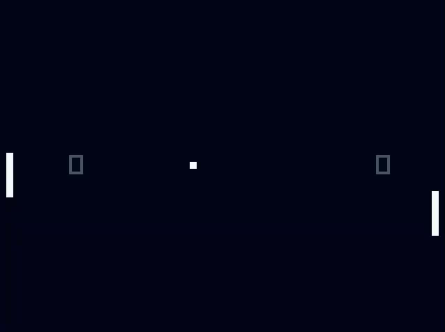

# pong-zig
A pong implementation in Zig using raylib-zig

## Compiling
1. Make sure you have Zig installed
2. Go to the root directory, run `zig build`
3. An executable will be generated inside the `zig-out` directory

## Gameplay
1. In the Main Menu, press 1 for Easy mode, 2 for Medium, 3 for Hard mode
2. Use the up and down arrow keys to move your paddle
3. Press `p` to pause the game
